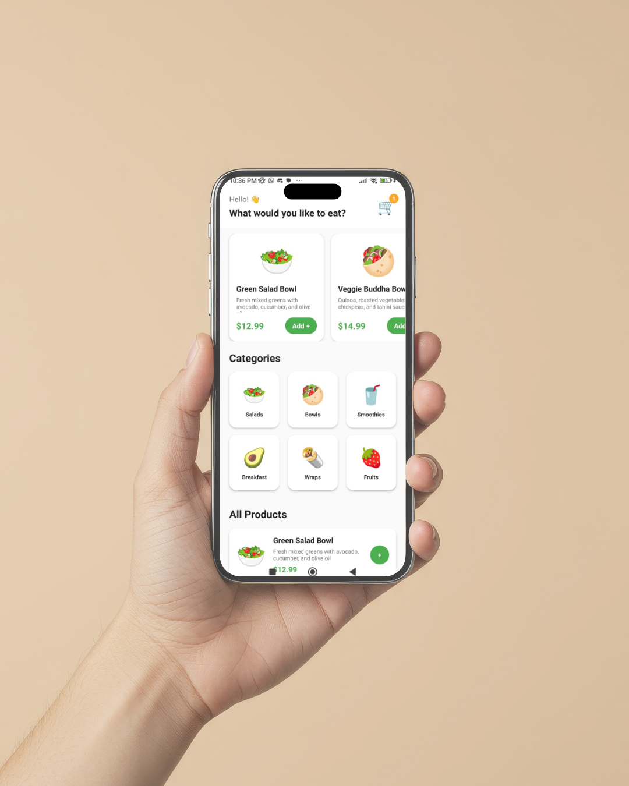
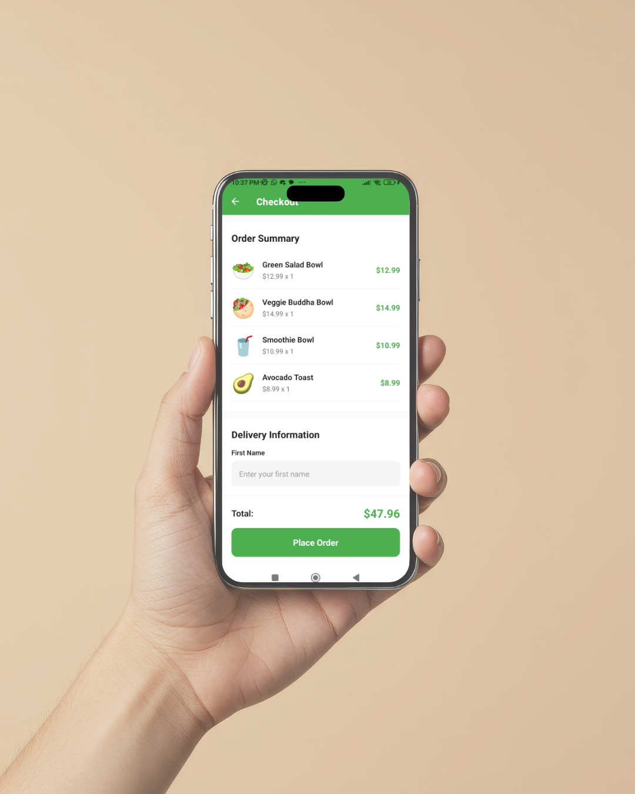

# Agree - Healthy Vegetarian Food Delivery App

## 📚 School Project

A React Native mobile application developed as a school project. The app provides a platform for ordering healthy vegetarian meals.

---

## 📸 App Screenshots

<div align="center">
  <table>
    <tr>
      <td align="center">
        
        <p><b>Home Screen</b></p>
      </td>
      <td align="center">
        
        <p><b>Categories</b></p>
      </td>
    </tr>
    <tr>
      <td align="center">
        
        <p><b>Checkout Screen</b></p>
      </td>
      <td align="center">
        
        <p><b>Splash Screen</b></p>
      </td>
    </tr>
  </table>
</div>

---

## 📋 Project Overview


**Agree** is a user-friendly food delivery application that specializes in vegetarian cuisine. The app allows users to browse products by categories, add items to their cart, and proceed to checkout with a simple and intuitive interface.

### Key Features
- ✅ Browse healthy vegetarian food products
- ✅ Category-based product filtering
- ✅ Shopping cart management
- ✅ Checkout with customer information form
- ✅ Splash screen with animation
- ✅ Responsive design optimized for mobile and web

---

## 🛠️ Tech Stack

- **Framework**: React Native with Expo
- **Language**: JavaScript
- **Navigation**: React Navigation


---

## 📁 Project Structure

```
reactNat/
├── src/
│   ├── screens/
│   │   ├── SplashScreen.js      # Animated splash screen
│   │   ├── HomeScreen.js        # Main product listing and categories
│   │   └── CheckoutScreen.js    # Order checkout and payment
│   ├── constants/
│   │   └── colors.js            # App color theme
│   └── data/
│       └── productsData.js       # Product database
├── assets/                       # Images and static assets
├── App.js                        # Main app component
├── app.json                      # Expo configuration
├── package.json                  # Dependencies
└── README.md                     # This file
```

---

## 🚀 Getting Started

### Prerequisites
- Node.js (v14 or higher)
- npm or yarn package manager
- Expo CLI (optional)

### Installation

1. **Clone or navigate to the project directory**
   ```bash
   git clone https://github.com/haytamRaba/agree---ReactNative.git
   cd reactNat
   ```

2. **Install dependencies**
   ```bash
   npm install
   ```

### Running the App

#### Web Version
```bash
npm run web
```

#### Android
```bash
npm run android
```

#### iOS
```bash
npm run ios
```

---

## 🎨 Design & Features

### Color Theme
The app uses a healthy, natural color palette featuring:
- Fresh greens for primary actions
- Neutral backgrounds for clarity
- High contrast for readability

### Navigation Flow
1. **Splash Screen** - Animated introduction with app branding
2. **Home Screen** - Browse products and categories
3. **Cart** - Review selected items
4. **Checkout** - Enter customer information and complete order

---

## 📱 User Interface

- **HomeScreen**: Displays popular products and categories for easy navigation
- **CheckoutScreen**: Collects customer details (name, address, phone, email)
- **Cart Functionality**: Add/remove items and view total price

---

## 💻 Development Notes

- The app is built using Expo, which allows for quick development and testing across platforms
- Navigation is managed with React Navigation for smooth screen transitions
- Product data is stored locally in `productsData.js` for easy modification

---

## 🔄 Future Enhancements

- Integration with backend API for real-time product updates
- User authentication and account management
- Payment gateway integration
- Order tracking system
- User reviews and ratings
- Wishlist functionality

---

## 👨‍💼 Author

School Project - Haytam Raba G9 

---

## 📄 License
This project is licensed under the MIT License – see the [LICENSE](LICENSE) file for details.

Created for educational purposes as a school project.
