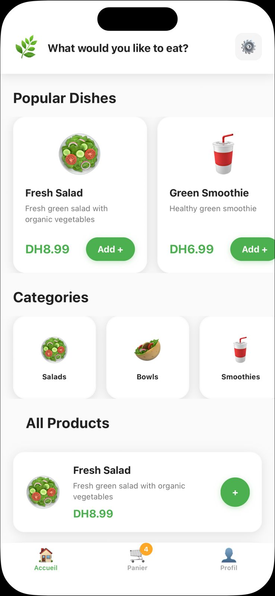
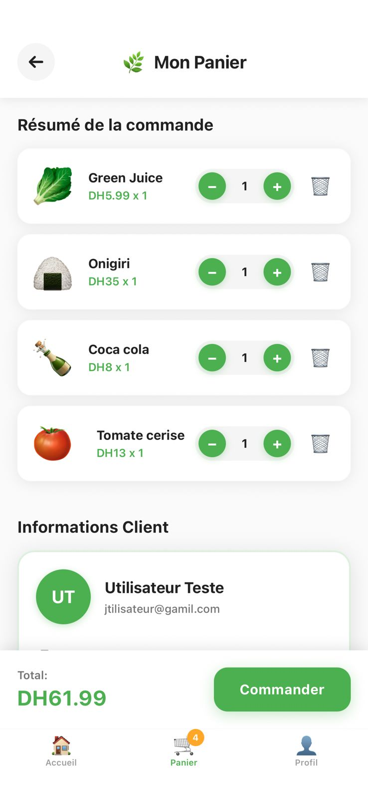
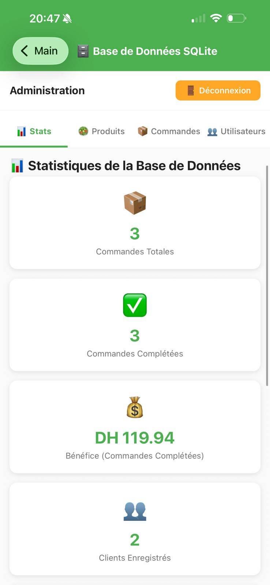
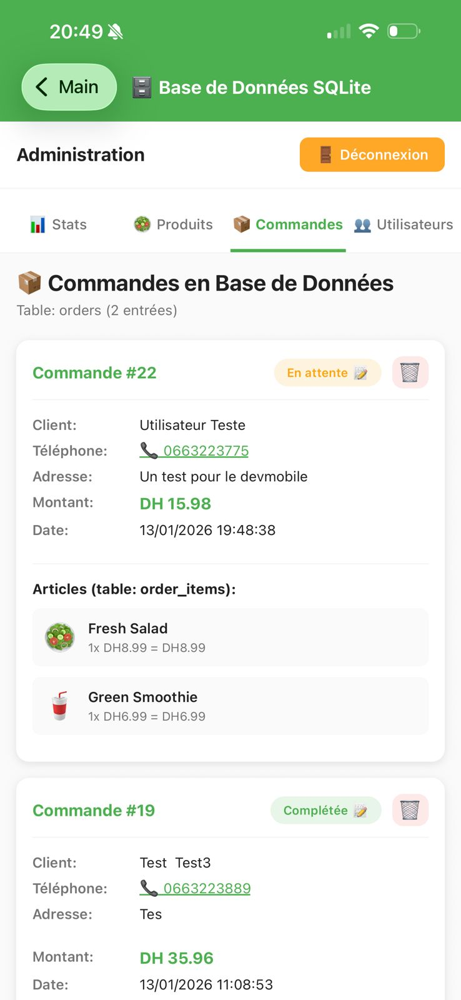
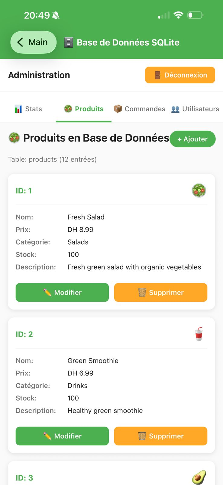
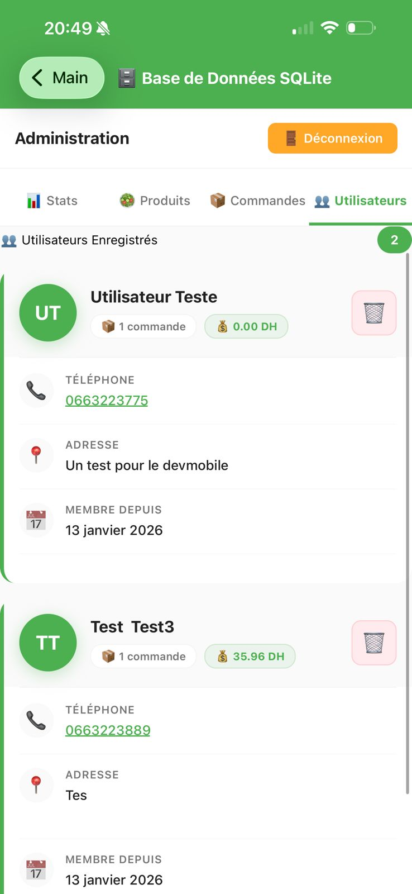
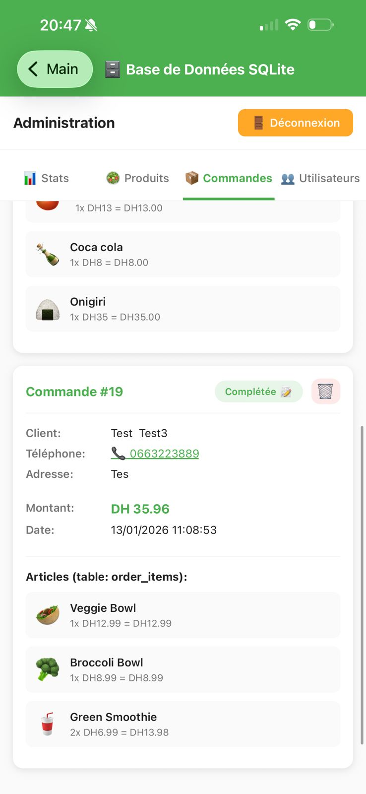

# 🌿 Agree - Healthy Vegetarian Food Delivery App

## 📚 School Project

A React Native mobile application developed as a school project. The app provides a modern and intuitive platform for ordering healthy vegetarian meals with real-time order management and admin panel.

---

## 📸 App Screenshots

### 🛍️ Client Side

<div align="center">
  <table>
    <tr>
      <td align="center">
        
        <p><b>🏠 Home Screen</b></p>
      </td>
      <td align="center">
        
        <p><b>🛒 Shopping Cart</b></p>
      </td>
      <td align="center">
        
        <p><b>👤 User Profile</b></p>
      </td>
      <td align="center">
        
        <p><b>✨ Splash Screen</b></p>
      </td>
    </tr>
  </table>
</div>

### 📊 Admin Panel

<div align="center">
  <table>
    <tr>
      <td align="center">
        
        <p><b>📈 Statistics Dashboard</b></p>
      </td>
      <td align="center">
        
        <p><b>📦 Order Management</b></p>
      </td>
      <td align="center">
        
        <p><b>🥗 Product Management</b></p>
      </td>
    </tr>
    <tr>
      <td align="center">
        
        <p><b>👥 User Management</b></p>
      </td>
      <td align="center">
        
        <p><b>📋 Orders Overview</b></p>
      </td>
      <td align="center">
        
        <p><b>✨ Splash Screen</b></p>
      </td>
    </tr>
  </table>
</div>

---

## 📋 Project Overview

**Agree** is a user-friendly food delivery application that specializes in vegetarian cuisine. The app allows users to browse products by categories, add items to their cart, and proceed to checkout with a simple and intuitive interface.

### Key Features

#### 🛍️ Client Features

- ✅ Browse healthy vegetarian food products
- ✅ Category-based product filtering
- ✅ Shopping cart management with real-time updates
- ✅ User profile and account management with auto-login
- ✅ Checkout with customer information form (auto-filled from profile)
- ✅ Order history and tracking with detailed product information
- ✅ Custom alerts and notifications
- ✅ Responsive design optimized for mobile and web
- ✅ Bottom tab navigation for easy access
- ✅ Click-to-call functionality for customer support

#### 👨‍💼 Admin Features

- ✅ Real-time statistics dashboard with revenue and order metrics
- ✅ Complete order management system with customer details
- ✅ Product inventory management
- ✅ Client management panel with contact information
- ✅ Sales analytics and reports
- ✅ SQLite database integration with web compatibility (mock data fallback)
- ✅ Auto-refresh data when switching between tabs
- ✅ Secure admin authentication
- ✅ Mobile-optimized responsive layout

---

## 🛠️ Tech Stack

- **Framework**: React Native with Expo SDK 54
- **Language**: JavaScript
- **Navigation**: React Navigation 7.x (Stack + Bottom Tabs)
- **Database**: SQLite (expo-sqlite 16.0.10) with web mock data fallback
- **State Management**: React Context API (CartContext, UserContext, ToastContext)
- **Storage**: AsyncStorage for user session persistence
- **UI Components**: Custom alert system with modal designs
- **Lifecycle Management**: useFocusEffect for auto-refresh functionality
- **Web Compatibility**: Platform detection with mock data system

---

## 📁 Project Structure

```
agree---ReactNative/
├── src/
│   ├── screens/
│   │   ├── SplashScreen.js       # Animated splash screen
│   │   ├── HomeScreen.js         # Main product listing and categories
│   │   ├── CheckoutScreen.js     # Order checkout with auto-fill
│   │   ├── ProfileScreen.js      # User profile and login
│   │   ├── OrdersScreen.js       # Order history with product details
│   │   ├── AdminScreen.js        # Admin dashboard (Stats, Products, Orders, Clients)
│   │   └── AdminLoginScreen.js   # Secure admin authentication
│   ├── components/
│   │   └── CustomAlert.js        # Custom modal alert system
│   ├── context/
│   │   ├── CartContext.js        # Shopping cart state management
│   │   ├── UserContext.js        # User authentication and session
│   │   └── ToastContext.js       # Toast notifications
│   ├── services/
│   │   └── database.js           # SQLite operations + web mock data
│   ├── constants/
│   │   └── colors.js             # App color theme
│   └── data/
│       └── productsData.js       # Product database
├── assets/                        # Images and screenshots
├── .github/
│   └── copilot-instructions.md   # Project documentation
├── App.js                         # Main app with navigation
├── app.json                       # Expo configuration
├── package.json                   # Dependencies
└── README.md                      # Documentation
```

---

## 🚀 Getting Started

### Prerequisites

- Node.js (v14 or higher)
- npm or yarn package manager
- Expo CLI (optional)

### Installation

1. **Clone or navigate to the project directory**

   ```bash
   git clone https://github.com/haytamRaba/agree---ReactNative.git
   cd reactNat
   ```

2. **Install dependencies**
   ```bash
   npm install
   ```

### Running the App

#### Web Version

```bash
npm run web
```

#### Android

```bash
npm run android
```

#### iOS

```bash
npm run ios
```

---

## 🎨 Design & Features

### Color Theme

The app uses a healthy, natural color palette featuring:

- Fresh greens for primary actions
- Neutral backgrounds for clarity
- High contrast for readability

### Navigation Flow

1. **Splash Screen** - Animated introduction with app branding
2. **Home Screen** - Browse products and categories with bottom tab navigation
3. **Cart** - Review selected items with quantity management
4. **Checkout** - Auto-filled customer information from profile
5. **Profile** - User login and session management
6. **Orders** - View order history with detailed product information
7. **Admin Panel** - Comprehensive dashboard with 4 tabs:
   - **Stats**: Revenue, orders, and customer metrics
   - **Products**: Inventory management
   - **Orders**: Order tracking with customer details
   - **Clients**: Customer database with contact info

---

## 📱 User Interface

### Client Features
- **HomeScreen**: Displays popular products and categories with intuitive navigation
- **CheckoutScreen**: Auto-filled customer details from user profile (name, address, phone)
- **Cart Functionality**: Add/remove items with real-time total calculation
- **OrdersScreen**: Complete order history with product details, quantities, and timestamps
- **ProfileScreen**: User login and account management with session persistence

### Admin Panel
- **Statistics Dashboard**: Real-time metrics for revenue, orders, and customer count
- **Product Management**: Add, edit, and delete products from inventory
- **Order Management**: View all orders with customer information and contact details
- **Client Database**: Comprehensive customer list with phone, address, and registration date
- **Responsive Layout**: Mobile-optimized design with proper spacing and alignment

---

## 💻 Development Notes

- The app is built using Expo SDK 54, which allows for quick development and testing across platforms
- Navigation is managed with React Navigation 7.x for smooth screen transitions
- Product data is stored locally in `productsData.js` for easy modification
- SQLite database integration with automatic fallback to mock data for web compatibility
- Context API used for state management (Cart, User, Toast)
- Auto-refresh functionality using `useFocusEffect` hook
- Mobile-optimized CSS with responsive layouts
- Platform detection ensures compatibility across web, iOS, and Android

### Database Architecture

- **SQLite**: Used on native platforms (iOS/Android) with expo-sqlite
- **Mock Data System**: Automatic fallback for web environments
- **Tables**: customers, products, orders, order_items
- **Auto-increment counters**: For mock data consistency
- **Session persistence**: AsyncStorage for user login state

---

## 🔄 Recent Updates (January 2026)

### Version 2.0 - Major Feature Release

- ✅ **Admin Dashboard Overhaul**: Complete redesign with 4 tabs (Stats, Products, Orders, Clients)
- ✅ **Web Compatibility**: Implemented mock data system for SQLite fallback on web
- ✅ **Auto-Fill Checkout**: User profile data automatically populates checkout form
- ✅ **Enhanced Order History**: Detailed product list with quantities and prices
- ✅ **Client Management**: Admin panel now includes comprehensive customer database
- ✅ **Auto-Refresh**: useFocusEffect ensures data stays synchronized
- ✅ **Mobile Optimization**: Responsive CSS with improved layout for smaller screens
- ✅ **Session Persistence**: AsyncStorage integration for user login state
- ✅ **Click-to-Call**: Phone numbers in admin panel are interactive
- ✅ **Bug Fixes**: Resolved CSS display issues and data synchronization problems

---

## 🔮 Future Enhancements

- Integration with backend API for real-time product updates
- Push notifications for order status updates
- Payment gateway integration (Stripe, PayPal)
- Advanced order tracking with delivery status
- User reviews and ratings system
- Wishlist functionality
- Multilingual support (French/English)
- Dark mode theme
- Export data to CSV/Excel for admin reports

---

## 👨‍💼 Authors

School Project - **Haytam Raba** & **Wassim Lazim** - G9

---

## 📄 License

This project is licensed under the MIT License – see the [LICENSE](LICENSE) file for details.

Created for educational purposes as a school project.
